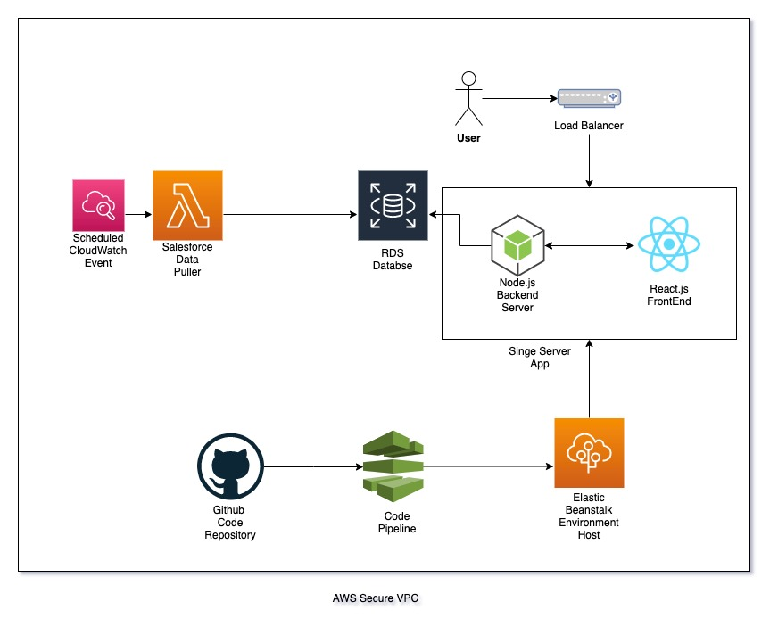

# Department Portal Design Document

There are two core design aspects for this applicaiton. The first is getting the data from salesforce into the AWS databse, and the second is the web application itself.

## Data Ingestion Pipeline

The architecture for the data pipeline is straight forward. 

1. AWS Cloudwatch Event schedules when the data will be pulled.

2. This triggers an AWS Lambda function to then retrieve the new data from Salesforce and load it into the RDS database.

## Web Application

For the web application, a single server design should suffice. 
1. The user will first connect to an AWS Load Balancer, which will aid in preventing server overloads by creating new servers on demand if usage gets to be too much for the server.

2. The load balancer will send the users request to the Node.js backend, which will return the React.js frontend or API data, depending on the endpoint requested by the user.

